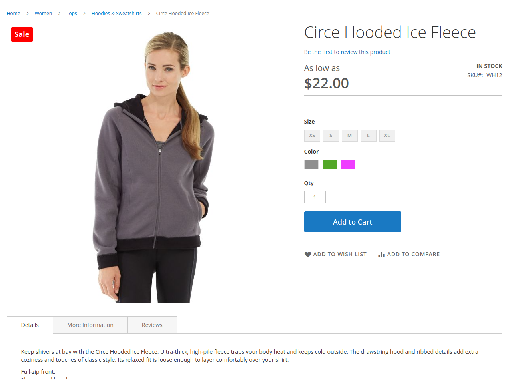

> **Abandoned.** This package is no longer maintained. Use [OpenLabel](https://github.com/iranimij/openlabel) (`iranimij/openlabel`) instead: product labels for Magento 2 and Hyvä, free and MIT.

## Iranimij_ProductLabels
By this module you can add labels to your product images.

### Installation
```aiignore
composer require iranimij/product-labels
```

### Features
1. Adding sales label to product images that are on sale.

### Upcoming Features
1. Adding a new label to product images that are new.
2. Creating custom labels.
3. Adding labels based on different conditions.
4. ...

### Example Usage


